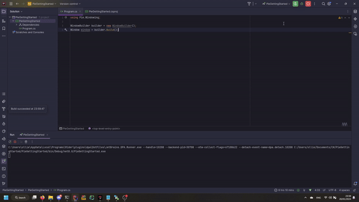
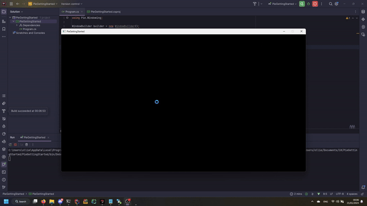

# 1 - Basic Window
The first step on our journey to making a beautiful coloured shape is to create a Window. Fortunately, Pie makes this
very easy.

Firstly, make sure you install these packages into your project:
* [Pie](https://www.nuget.org/packages/Pie/)
* [Pie.Windowing](https://www.nuget.org/packages/Pie.Windowing/)

## Creating a window
### The WindowBuilder
Who doesn't love a builder pattern! Maybe you don't, in which case, sorry. To create a window, we must use a
[WindowBuilder](xref:Pie.Windowing.WindowBuilder). A window builder provides a convenient way to create a window with
various initial parameters.

Add the following to your code:

```csharp
WindowBuilder builder = new WindowBuilder();
```

This creates a window builder with a default set of parameters. If you want, you can just leave it like this. The
default parameters always create a 1280x720 window with a default title.

For this part of the tutorial, we're not going to add anything else yet. We'll do that a bit later.

Okay, now add the following to your code:

```csharp
Window window = builder.Build();
```

And that's it. Yep. Really. Try running your program!



... Oh. The window appears and then immediately disappears.

Don't worry, this is completely normal. The window opens, and then the program immediately exits, causing the window to
close. Remember: **Pie does not provide a window loop for you!** This is something you must do yourself. So let's do that!

### Creating a window loop
Now, you may think it may be as simple as adding a `while (true)` loop, but try that and...



Not ideal.

So why is this happening? Sure, the window stays open now, but nothing happens, you can't click close, and after a few
seconds the OS says the program isn't responding.

Well, this is because, to the OS, the program *isn't* actually responding at all. The window has been created, and then
the program immediately enters an endless loop, and the window just sits there, unable to do anything.

To resolve this, we must set up an **event loop**.

### The event loop
The event loop is a simple loop that essentially asks the window "has anything happened since I last checked?". The
event loop has 2 main goals:
* It tells the OS that the window is not just sitting there.
* It allows you to get events involving the window, such as when the close button is pressed.

Let's create one!

First, if you created a while loop, remove it, then add the following:

```csharp
bool shouldClose = false;
while (!shouldClose)
{

}
```

The `shouldClose` variable is very important, and we'll make use of it in just a second. Everything from this point
onwards will go inside this while loop.

#### Polling events
The key thing we need to do to tell the OS that the window is alive is to poll for events.

There are two ways to poll for events:
* Using a `foreach` loop
* Using a `while` loop

The `foreach` loop is easier to read, but the `while` loop does not allocate an enumerator. As such, we recommend that
everyone uses the `while` way, and we will be doing it that way in this tutorial.

Add the following to your code:

```csharp
while (window.PollEvent(out IWindowEvent winEvent))
{

}
```

If you run your code now, you'll see that simply adding this has now meant that the window is responsive, and doesn't
cause issues with the OS. However, the close button does not work. Let's fix that!

#### IWindowEvent
The [IWindowEvent](xref:Pie.Windowing.Events.IWindowEvent) interface is the base for a bunch of different event types.
For the purposes of this tutorial, we're only interested in two of them, for which we will get into the second one later.

