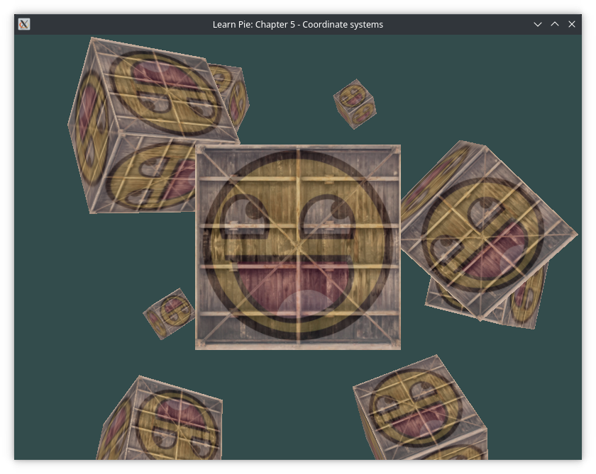

# Tutorial 5: Coordinate Systems
This tutorial shows you how to create a basic coordinate system, creating a basic camera, along with rendering multiple cubes at various positions and rotations in the world

